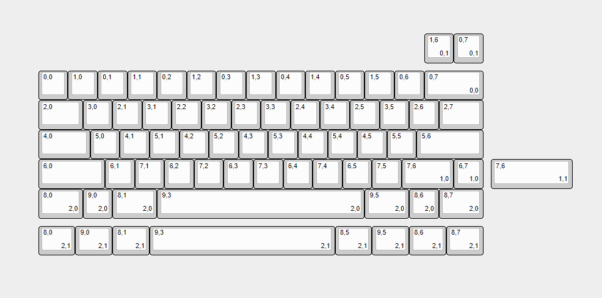

<style>
    table {
        width: 100%;
    }
</style>

# Commission Report

*This documentation was made to ensure all related function was implemented correctly, Customer has to check this document before making decision to be manufactured. Read this documentation mean customer agreed what included in the design and the result after manufacture proccess*

## Requested Layout
```
Layout  : 60%
Detail  : 60% layout with Split Backspace, Split Right-Shift, ANSI & Tsangan Bottom Row 
KLE     : https://keyboard-layout-editor.com/20170asd09809812409as09d8
```

## Technical Specification
```
MCU             : Onboard Atmega32u4
Interface       : JST Only ( Compatible with h60, korn, alas by RME )
Number of Keys  : 73 Keys 
Number of Diode : 63 Pcs

USB Information
VID : 0x70F5
PID : 0x4A03
```

## Pinout Definition
### Matrix & Features Pinout
| Cols Labels | Pinout      | Rows Labels | Pinout      | Other Labels | Pinout      |
|-------------|-------------|-------------|-------------|--------------|-------------|
| COL 1       | B7          | ROW 1       | F5          | CAPS         | C7          |
| COL 2       | D2          | ROW 2       | F4          |              |             |
| COL 3       | D1          | ROW 3       | F1          |              |             |
| COL 4       | D0          | ROW 4       | F0          |              |             |
| COL 5       | B3          | ROW 5       | D7          |              |             |
| COL 6       | B2          | ROW 6       | D6          |              |             |
| COL 7       | B1          | ROW 7       | B4          |              |             |
| COL 8       | B0          | ROW 8       | B5          |              |             |
|             |             | ROW 9       | C6          |              |             |
|             |             | R0W 10      | B6          |              |             |

*Pinout can't show how actual layout looks like, please look into the firmware*

## KLE & Matrix Preview



## Firmware Information

 >Any firmware information would be updated after pcb has arrive or received by customer

### QMK info.json
```json
null
```

### VIA JSON
```json
null
```
