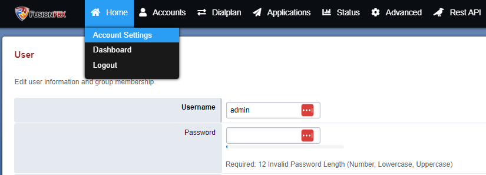
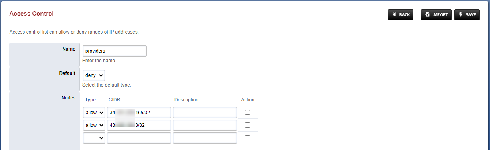
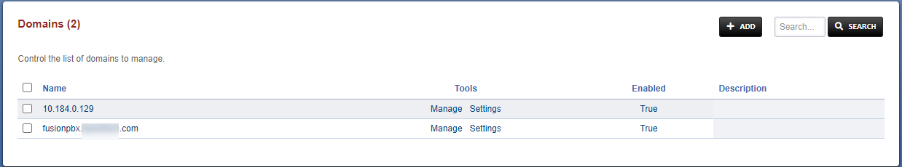
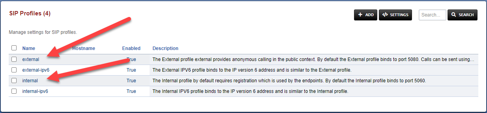
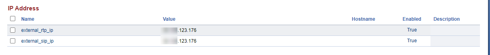

# Getting Started with FusionPBX

# Fusion Installation
1. Install Linux Debian 11 or any other supported OS
2. After installation complete, run this command to download installation script
    ```
    wget -O - https://raw.githubusercontent.com/fusionpbx/fusionpbx-install.sh/master/debian/pre-install.sh | sh;
    ```
3. Then run the installation
    ```
    cd /usr/src/fusionpbx-install.sh/debian && ./install.sh
    ```
4. Make sure no error appear in the installation, if yes please fix yourself ( i have no error after few installation with Debian 11 )
5. When complete, now you can access FusionPBX from browser. And make sure you save the temporary account that you can see after installation were done like this. **Please don't forget to save this until you change the password**
    ```
    Installation has completed.

    Use a web browser to login.
    domain name: https://000.000.000.000
    username: admin
    password: zxP5yatwMxejKXd

    The domain name in the browser is used by default as part of the authentication.
    If you need to login to a different domain then use username@domain.
    username: admin@x.x.x.x

    Additional information.
    https://fusionpbx.com/support.php
    https://www.fusionpbx.com
    http://docs.fusionpbx.com
    https://www.fusionpbx.com/training.php
    ```


# FusionPBX Pre-Setup
After first installation complete, and before you can use FusionPBX properly. You have to set few configuration to make sure the system will work as intended

1. Access FusionPBX via IP Address or Domain that has been set before ( or you can see the IP after installation were complete )


2. You can use Username & Password that shown after installation complete
    ```
    Use a web browser to login.
    domain name: https://000.000.000.000
    username: admin
    password: zxP5yatwMxejKXd
    ```
3. And immediately change the password after successfully login into dashboard


### IP Address & Domain Update
FusionPBX automatically update all variable and configuration with local IP that the host have. If you want to host FusionPBX on public are with Domain & Public IP, you must have to change some of configuration and variable. Here is few things that need to be change.
1. Advanced -> Access Control
2. Advanced -> Domains
3. Advanced -> SIP Profiles
4. Advanced -> Variables

### Example
1. **Advanced -> Access Control**

Under Access Control menu, go to `provider` and you can put SIP Vendor IP there and set it to Allow so you can make a connection to provider

2. **Advanced -> Domains**

Because we will access FusionPBX using Domain name, we need to set here using our domains. This domains also act as **Tenant**, if you have multiple customer you could use one server and different domains and customer will be proxied into domains were they access into it instead accessing all information on the server.

3. **Advanced -> SIP Profiles**


In SIP Profile, you can change `ext-rtp-ip` and `ext-sip-ip` to your IP Public so any connection made in the system will forwarded to Public IP instead local IP

4. **Advanced -> Variables**

Refer to IP Address and change both `external_rtp_ip` and `external_sip_ip` to your Public IP