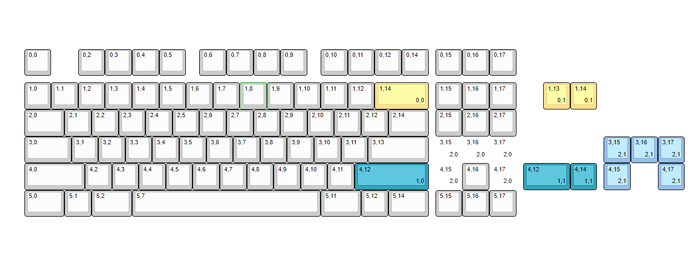
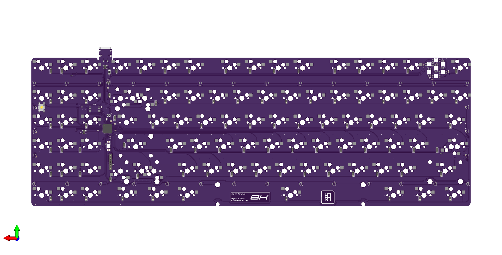

# Soyu 8K
TKL+ Keyboard PCB for Geonworks F1-8K ( HS Model of <a href='https://github.com/zykrah/fuyu'>Fuyu PCB by Zykrah</a> )

## Introduction

This PCB was made by request for one of our customer. They need PCB for **Geonworks F1-8K** that currently no available hotswap PCB in the market.


## Technical Spesification

- **Layout Size** : TKL+
- **Multi-Layout Option** : Split Backspace, Split Right-Shift, and Arrow Cluster
- **Compatible Switches** : MX Style Switches
- **Firmware** : QMK Firmware
- **Microcontroller** : Generic RP2040
- **Connector** : USB Type-C
- **Hardware Protection** : Fused Power-Line & ESD Protection
- **Other** : Caps-Lock & Num-Lock Indicator, Underglow RGB

## Render & Prototype
### Render


## Firmware & Software Information

```json title="VIA JSON"
{
    "name": "Soyu 8K",
    "vendorId": "0x70F5",
    "productId": "0x4A04",
    "matrix": {
        "rows": 6,
        "cols": 18
    },
    "menus": ["qmk_rgblight"],
    "layouts": {
        "labels": [
          "Split Backspacce",
          "Split Right-Shift",
          "8K Layout"
        ],
        "keymap": [
          [
            "0,0",
            {
              "x": 1
            },
            "0,2",
            "0,3",
            "0,4",
            "0,5",
            {
              "x": 0.5
            },
            "0,6",
            "0,7",
            "0,8",
            "0,9",
            {
              "x": 0.5
            },
            "0,10",
            "0,11",
            "0,12",
            "0,14",
            {
              "x": 0.25
            },
            "0,15",
            "0,16",
            "0,17"
          ],
          [
            {
              "y": 0.25
            },
            "1,0",
            "1,1",
            "1,2",
            "1,3",
            "1,4",
            "1,5",
            "1,6",
            "1,7",
            "1,8",
            "1,9",
            "1,10",
            "1,11",
            "1,12",
            {
              "w": 2
            },
            "1,14\n\n\n0,0",
            {
              "x": 0.25
            },
            "1,15",
            "1,16",
            "1,17",
            {
              "x": 1
            },
            "1,13\n\n\n0,1",
            "1,14\n\n\n0,1"
          ],
          [
            {
              "w": 1.5
            },
            "2,0",
            "2,1",
            "2,2",
            "2,3",
            "2,4",
            "2,5",
            "2,6",
            "2,7",
            "2,8",
            "2,9",
            "2,10",
            "2,11",
            "2,12",
            {
              "w": 1.5
            },
            "2,14",
            {
              "x": 0.25
            },
            "2,15",
            "2,16",
            "2,17"
          ],
          [
            {
              "w": 1.75
            },
            "3,0",
            "3,1",
            "3,2",
            "3,3",
            "3,4",
            "3,5",
            "3,6",
            "3,7",
            "3,8",
            "3,9",
            "3,10",
            "3,11",
            {
              "w": 2.25
            },
            "3,13",
            {
              "x": 0.25,
              "d": true
            },
            "3,15\n\n\n2,0",
            {
              "d": true
            },
            "3,16\n\n\n2,0",
            {
              "d": true
            },
            "3,17\n\n\n2,0",
            {
              "x": 3.25
            },
            "3,15\n\n\n2,1",
            "3,16\n\n\n2,1",
            "3,17\n\n\n2,1"
          ],
          [
            {
              "w": 2.25
            },
            "4,0",
            "4,2",
            "4,3",
            "4,4",
            "4,5",
            "4,6",
            "4,7",
            "4,8",
            "4,9",
            "4,10",
            "4,11",
            {
              "w": 2.75
            },
            "4,12\n\n\n1,0",
            {
              "x": 0.25,
              "d": true
            },
            "4,15\n\n\n2,0",
            "4,16",
            {
              "d": true
            },
            "4,17\n\n\n2,0",
            {
              "x": 0.25,
              "w": 1.75
            },
            "4,12\n\n\n1,1",
            "4,14\n\n\n1,1",
            {
              "x": 0.25
            },
            "4,15\n\n\n2,1",
            {
              "x": 1
            },
            "4,17\n\n\n2,1"
          ],
          [
            {
              "w": 1.5
            },
            "5,0",
            "5,1",
            {
              "w": 1.5
            },
            "5,2",
            {
              "w": 7
            },
            "5,7",
            {
              "w": 1.5
            },
            "5,11",
            "5,12",
            {
              "w": 1.5
            },
            "5,14",
            {
              "x": 0.25
            },
            "5,15",
            "5,16",
            "5,17"
          ]
        ]
    }
}
```
