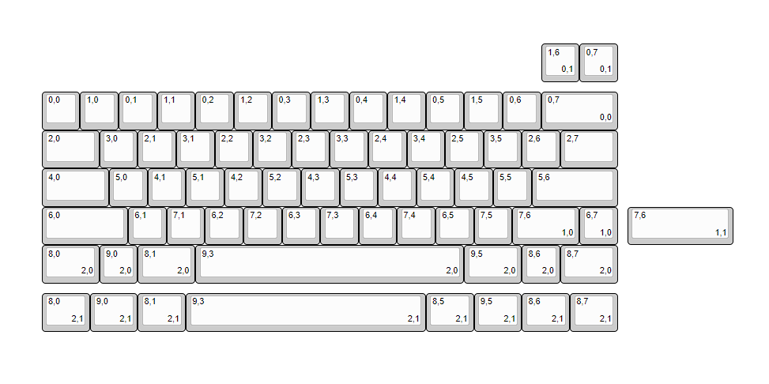
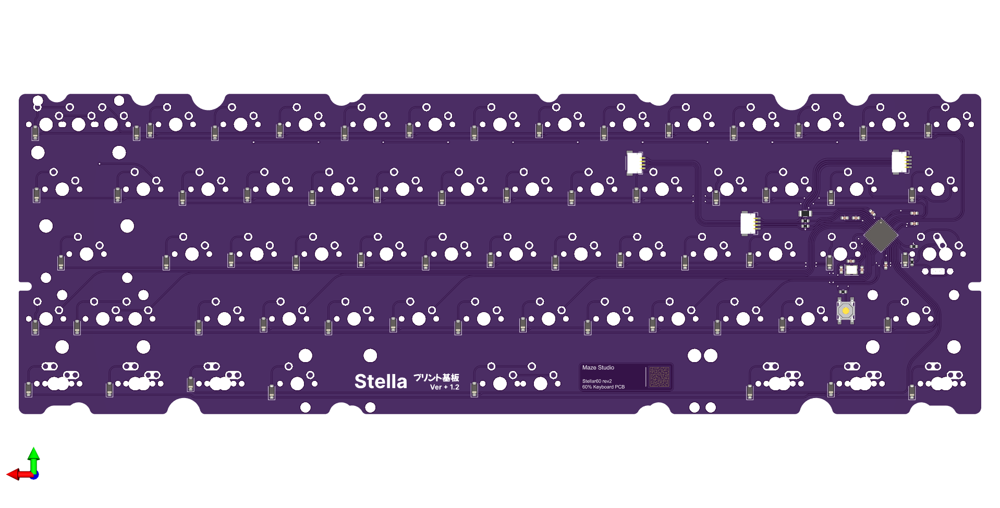

# Stellar60
60% Keyboard PCB with Multi-layout Support

## Introduction

This Keyboard was one of commissioned design from our fellow designer. You would take a look into supported layout below.

## Technical Spesification

- **Layout Size** : 60% Layouts with Split BS, Stepped-Caps, Split R-Shift and Tsangan Spacebar Support
- **Compatible Switches** : MX Style Switches
- **Micro-Controller** : Atmega32U4
- **Connector** : SM04B JST Connector with multiple placement for keyboard support
- **Hardware Protection** : Fused Power-Line
- **Other** : Caps-Lock Indicator

## Render & Prototype
### Render

## Firmware & Software Information